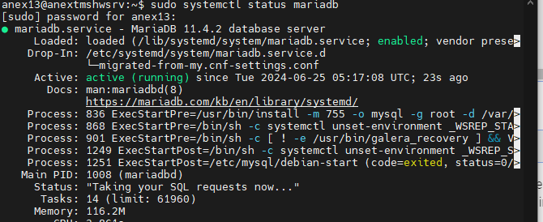
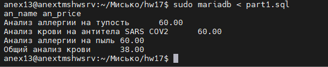
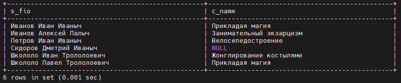
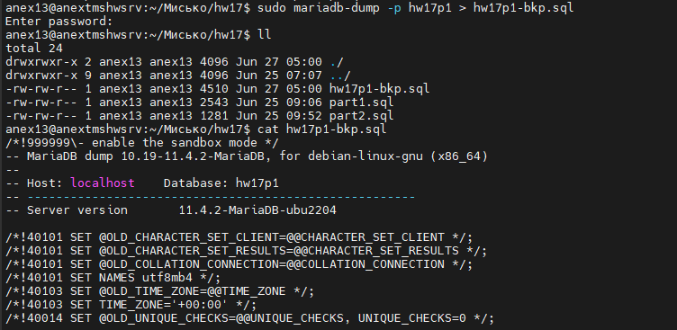
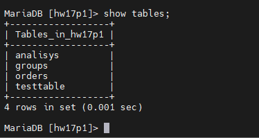
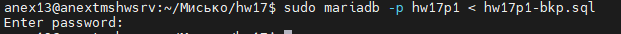
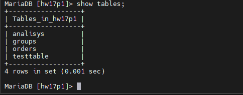

### Домашнее задание No18 

Цель: получить практический опыт написания SQL- запросов

#### Задание 1:
Вводные данные

Есть таблица анализов Analysis:

- an_id — ID анализа;
- an_name — название анализа;
- an_cost — себестоимость анализа;
- an_price — розничная цена анализа;
- an_group — группа анализов.
  
Есть таблица групп анализов Groups:
- gr_id — ID группы;
- gr_name — название группы;
- gr_temp — температурный режим хранения.

Есть таблица заказов Orders:
- ord_id — ID заказа;
- ord_datetime — дата и время заказа;
- ord_an — ID анализа.
  
Далее мы будем работать с этими таблицами.

Формулировка: вывести название и цену для всех анализов, которые
продавались 5 февраля 2020 и всю следующую неделю.

#### Задание 2(опционально):
Используя left join, напишите запрос, который будет выводить список всех
студентов и названий их курсов, которые они изучают. Если у студента нет
курсов, то вместо названия курса нужно выводить NULL. Для этого вам
необходимо связать таблицы "Студенты" и "Курсы".

#### Задание 3:
Шаги:
1. Создайте бэкап базы данных. Для этого используйте команду
"mysqldump" для создания полного дампа базы данных. Сохраните файл
дампа в безопасном месте, таком как внешний жесткий диск или облачное
хранилище.
1. Измените какие-либо данные в базе данных, например, добавьте новую
таблицу или обновите информацию в существующей таблице.
1. Восстановите базу данных из бэкапа, чтобы вернуть ее в исходное
состояние. Для этого используйте команду "mysql" и укажите имя базы
данных и файл дампа для восстановления.
1. Убедитесь, что база данных была восстановлена успешно, проверив
данные и таблицы в базе данных.
1. Создайте скрипт, который будет автоматически создавать бэкап базы
данных и отправлять его на удаленный сервер для хранения. Например, вы
можете использовать инструмент "cron" для регулярного создания бэкапов и
передачи их на удаленный сервер по расписанию.

### Ход дз:
#### Задание 1.
Установим MariaDB по мануалу с оф сайта.
Проверим  его работу: 

Создадим SQL файл [part1.sql](part1.sql) для формирования базы с необходимыми таблицами и запросами

получим следующую выдачу

#### Задание 2.

Создадим SQL файл [part2.sql](part2.sql) для формирования базы с необходимыми таблицами и запросами.

Получим вывод 

#### Задание 3.

Создадим дамп и проверим 

добавим табдицу

восстановим базу

проверим

как видим тестовая таблица никуда не делась тк в дампе есть только DROP TABLE IF EXIST 
для таблиц существовавших на момент бэкапа Для приведения к первоначальному виду можно сделать DROP DATABASE hw17p1 а потом накатить дамп.
