### Домашнее задание No19

#### Цель: научиться реализовывать отказоустойчивое решение для баз данных (на примере Postgresql)

#### Задание 1:
1. Создать два сервера, установить на них PostgreSQL и подключить их к
одной сети.
2. Настроить репликацию между серверами, чтобы изменения, вносимые
на одном сервере, автоматически реплицировались на другой.
3. Настроить отказоустойчивость, используя репликацию и механизм
автоматического переключения между серверами.
4. Проверить работу отказоустойчивого решения, симулируя отказ одного
из серверов и убедившись, что второй сервер продолжает работу и все
данные сохранены.

#### Опционально:

● Настроить систему резервного копирования, чтобы регулярно создавать
бэкапы данных и сохранять их на отдельном сервере.

● Документировать все шаги по настройке и проверке отказоустойчивого
решения и подготовить отчет о выполненной работе.

### Ход дз

Создадим 2 сервера с ип адресами 10.50.20.60 (main) и 10.50.20.68 (failover) установим на них PostgreSQL и keepalive
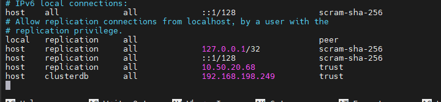
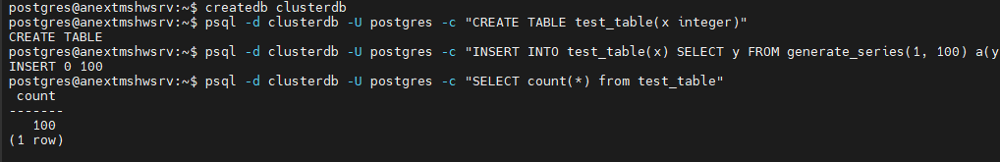
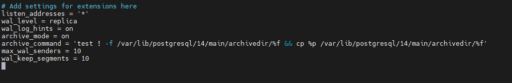
В новой версии вместо wal_keep_segments используется wal_keep_size
Настраиваем вторую машину и переносим на нее данные и проверяем
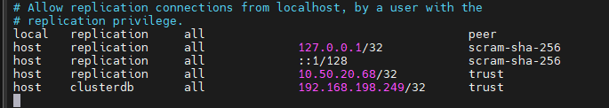
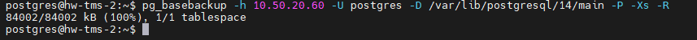
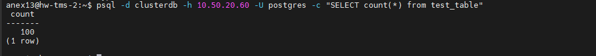
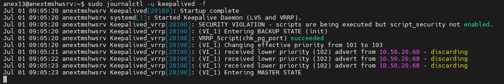
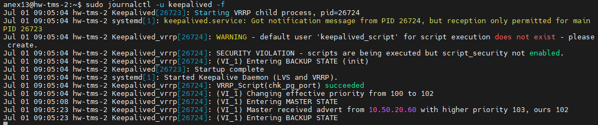
проверяем
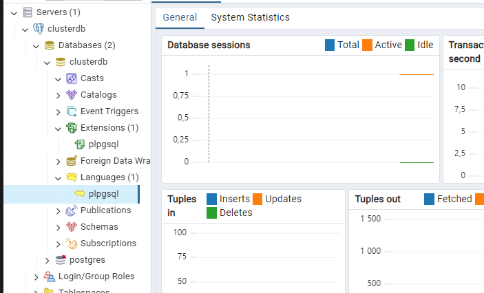
отключаем основной сервер
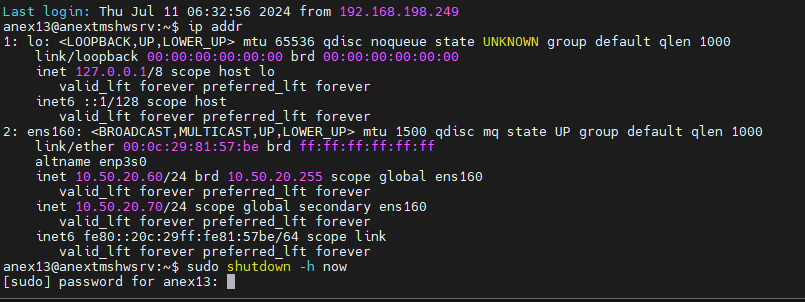
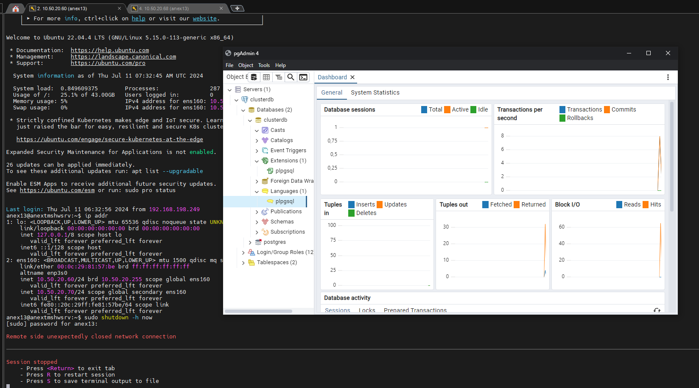
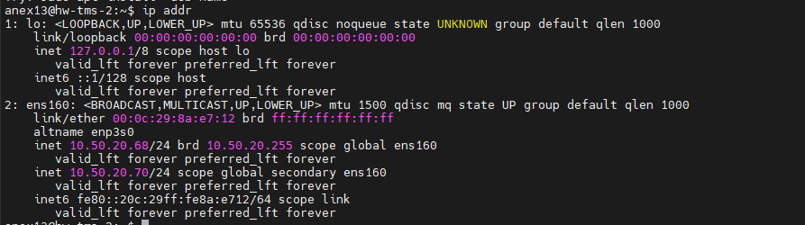
Всё работает и переключается.
pgadmin переключается на резервную бд буквально за секунды.