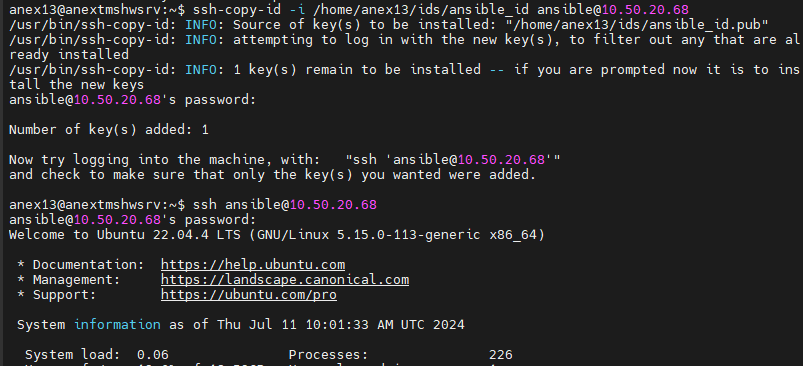

## Домашнее задание No20

Цель: получить практический опыт работы с системой управления
конфигурацией Ansible
! перед началом работы с Ansible, разверните еще одну виртуальную
машину,которая будет менеджиться с помощью него.
#### Задание 1: установить Ansible
Обновите список пакетов:

    sudo apt update
Установите пакет software-properties-common, который позволит добавлять
репозитории:

    sudo apt install software-properties-common
Добавьте репозиторий Ansible PPA:

    sudo apt-add-repository ppa:ansible/ansible
Обновите список пакетов:

    sudo apt update
Установите Ansible:

    sudo apt install ansible
#### Задание 2: сгенерировать SSH-ключ
● Откройте терминал на вашем контролирующем хосте.

● Запустите команду для генерации ключа:
ssh-keygen -t rsa -b 4096
При выполнении этой команды вам будет предложено ввести путь к файлу,
в котором будет сохранен ключ, а также парольная фраза (пароль не
обязателен, но рекомендуется).
После того, как ключ будет сгенерирован, скопируйте его на управляемый
хост:
ssh-copy-id user@managed_host
В этой команде "user" - это имя пользователя на управляемом хосте, а
"managed_host" - имя или IP-адрес управляемого хоста.

● При выполнении этой команды вам будет предложено ввести пароль
пользователя на управляемом хосте.

● После успешной передачи ключа на управляемый хост вы можете
использовать Ansible для управления им.
#### Задание 3: просмотрите и повторите все манипуляции, указанные в
видеоуроке по ссылке
https://www.youtube.com/watch?v=O5R6EBdaZZg&list=PLg5SS_4L6LYufspdPu
pdynbMQTBnZd31N&index=4
В данном ролике рассматривается шаги подключения к серверам Linux.
### Ход дз

На контролируемой машине создадим юзера ansible и сделаем ему беспарольный sudo

проверим

На контролирующей сгенерим ключ, прокинем его в контролируемую и проверим 

создадим inventory 

проверим пингом

создадим конфиг

проверим

## Доп дз
Нужно с помощью ansible установить:
1) mysql/postgres (проверить, что он запущен после установки)
2) nginx (плюс сделать возможность добавлять свою конфигурацию для nginx)
   
Важно, чтобы была возможность выполнять playbook неограниченное количество раз, и работало все без ошибок

Создадим playbook

Запустим нескалько раз

Всё выполняется работает.
